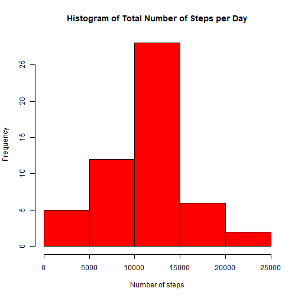
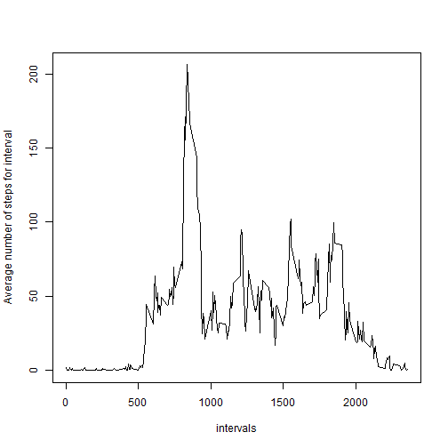
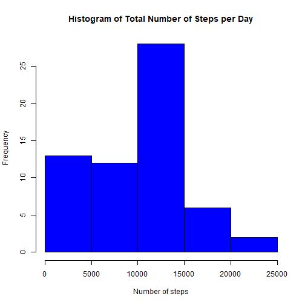
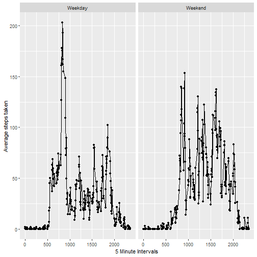

This is the set function to make echo = TRUE

``` r
knitr::opts_chunk$set(echo = TRUE)
```

This is the function to read the data into R and loading packages that will
be used in the project.

``` r
library(dplyr)
library(impute)
library(ggplot2)
data <- read.csv("repdata_data_activity/activity.csv", colClasses = "character")
```


This is the code for:

* Calculating the number of steps per day and then plotting a histogram of this.

* Calculating and displaying the median and mean number of steps per day.


``` r
noNAdata <- data[!is.na(data$steps), ]
noNAdata$steps <- as.numeric(noNAdata$steps)
groups <- noNAdata %>% group_by(date)
summary <- groups %>% summarise(groupsums = sum(steps))
hist(summary$groupsums, col = "red", xlab = "Number of steps",
     main = "Histogram of Total Number of Steps per Day")
```



``` r
mean_steps <- mean(summary$groupsums)
median_steps <- median(summary$groupsums)
cat("The mean is:", mean_steps, "\n")
```

```
## The mean is: 10766.19
```

``` r
cat("The median is:", median_steps, "\n")
```

```
## The median is: 10765
```

This is the code for:

* Making a line graph of the 5-minute intervals and average number of steps taken. 

* Calculates the maximum number of steps of the days and displays it. 


``` r
noNAdata$steps <- as.numeric(noNAdata$steps)
five_minute_groups <- noNAdata %>% group_by(interval)
five_minute_summary <- five_minute_groups %>% summarise(average = mean(steps))
five_minute_summary$interval <- as.numeric(five_minute_summary$interval)
five_minute_summary <- five_minute_summary %>% arrange(interval)
plot(five_minute_summary$interval,five_minute_summary$average, type = "l",
     col = "black"
     , xlab = "intervals", ylab = "Average number of steps for interval")
```



``` r
max <- max(five_minute_summary$average)
max
```

```
## [1] 206.1698
```

This is the code for: 

* Calculating the total number of NA values in the dataset.

* Using the impute.knn() function to impute the missing values into a copy of the dataset. 

* Making a histogram of the total number of steps.

* Calculating and reporting the mean and median values   


``` r
numberofNAs <- sum(is.na(data$steps))
cat("The number of NAs present in the dataset is:", numberofNAs, "\n")
```

```
## The number of NAs present in the dataset is: 2304
```

``` r
copydata <- data
copydata$steps <- as.numeric(copydata$steps)
copydata$interval <- as.numeric(copydata$interval)
copydata$interval_scaled <- scale(copydata$interval)
matrixdata <- as.matrix(copydata[, c("steps", "interval_scaled")])
suppressWarnings(
  invisible(capture.output({
    imputed_matrix <- impute::impute.knn(matrixdata)$data
  }))
)
copydata$steps <- imputed_matrix[, "steps"]
copydata$date <- as.Date(copydata$date)
groups <- copydata %>% group_by(date)
summary <- groups %>% summarise(groupsums = sum(steps))
hist(summary$groupsums, col = "blue", xlab = "Number of steps",
     main = "Histogram of Total Number of Steps per Day")
```



``` r
mean_steps <- mean(summary$groupsums)
median_steps <- median(summary$groupsums)
cat("The mean is:", mean_steps, "\n")
```

```
## The mean is: 9354.419
```

``` r
cat("The median is:", median_steps, "\n")
```

```
## The median is: 10395
```
Both the mean and the median decreased when the NA values were filled by imputation

This is the code for:

* Separating the dates into weekdays and weekends.

* Plotting line graphs of the 5 minute intervals and average steps taken across both facets.


``` r
copydata$date <- as.Date(copydata$date, format = "%Y-%m-%d")
copydata$weekdays <- weekdays(copydata$date)
copydata$DayClass <- ifelse(copydata$weekdays %in% c("Saturday", "Sunday"), "Weekend", "Weekday")
copydata$DayClass <- factor(copydata$DayClass)
copydata$steps <- as.numeric(copydata$steps)
copydata$interval <- as.numeric(copydata$interval)
groups <- copydata %>% group_by(interval,DayClass)
summary <- groups %>% summarise(average = mean(steps))
```

```
## `summarise()` has grouped output by 'interval'. You can override using the `.groups` argument.
```

``` r
g <- qplot(interval, average, data = summary, facets = .~DayClass)
g2 <- g + geom_line() + labs(x = "5 Minute Intervals", y = "Average steps taken")
g2
```


